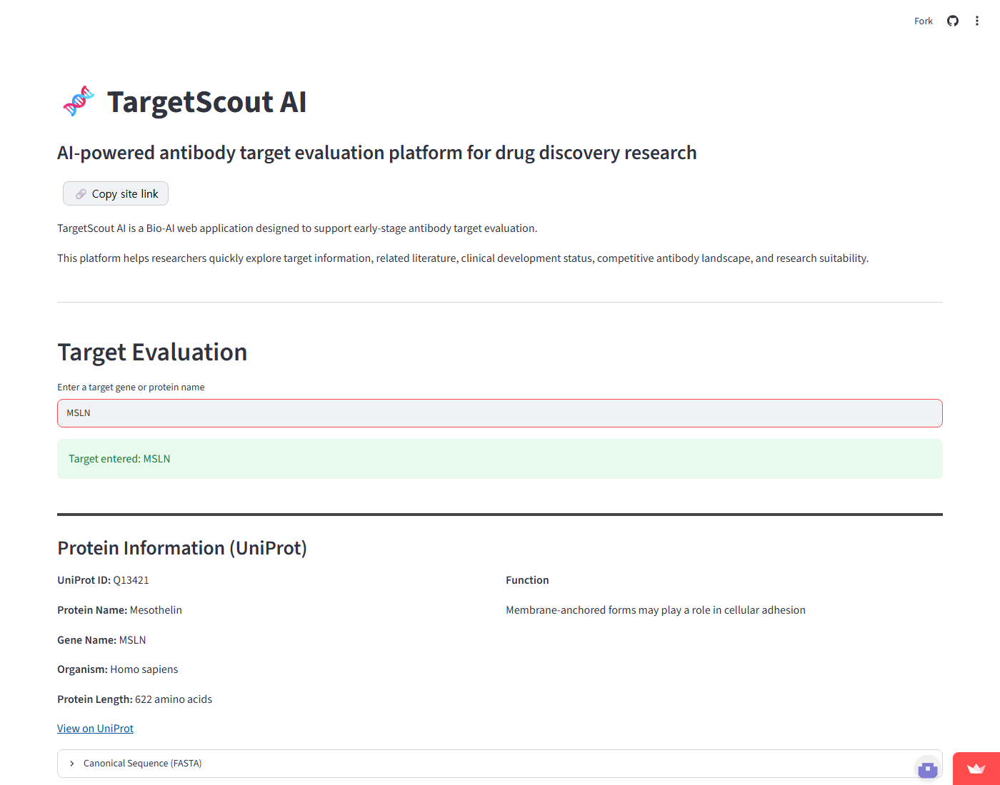
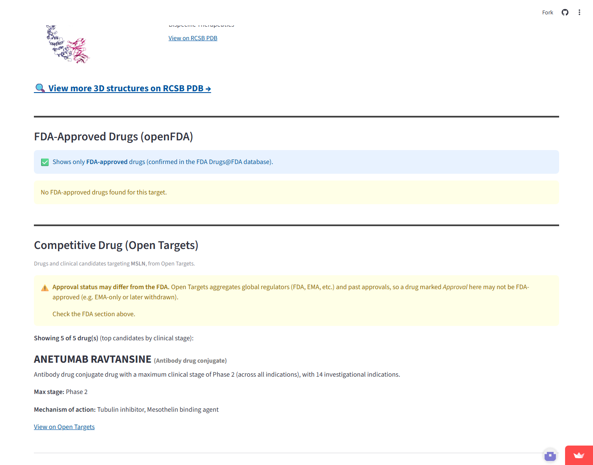
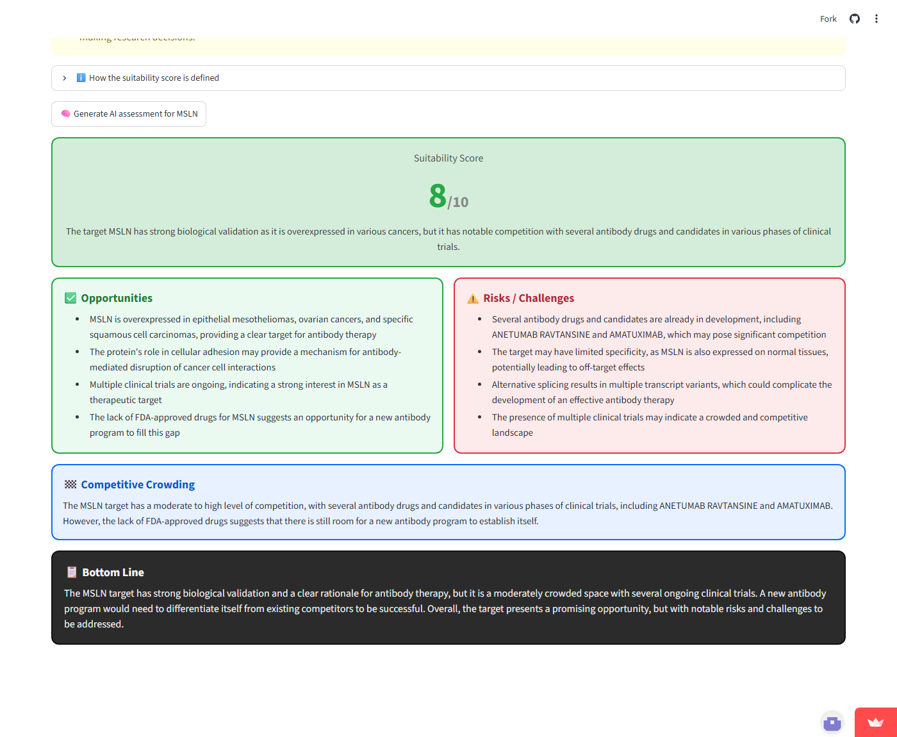

# TargetScout AI

Bio-AI platform for antibody target evaluation and research intelligence.

🔗 **Live app:** https://targetscout-ai-2r93scygucnqwntbd5ta2q.streamlit.app

---

## Usage Example

A single search for **`MSLN`** produces the full dashboard below.

<p align="center">
  <br>
  <em>Protein information, gene summary, and 3D structures for a searched target.</em>
</p>

<p align="center">
  <br>
  <em>FDA-approved and competitive drugs targeting the antigen.</em>
</p>

<p align="center">
  <br>
  <em>AI-generated suitability score with opportunities, risks, and a bottom-line verdict.</em>
</p>

---

## Overview

TargetScout AI is a web application designed for researchers working in antibody engineering, oncology, and drug discovery.

The platform helps users evaluate a therapeutic target by integrating information from multiple public biomedical databases into a single dashboard.

Enter a target gene or protein (e.g., **MSLN, HER2, TROP2, FRα/FOLR1, CLDN18**) and the app resolves it to the official gene symbol, then pulls together protein, structural, competitive, regulatory, clinical, and literature information.

---

## Example Workflow

Search **`MSLN`** (mesothelin) and, on a single screen, you get:

1. **Protein Information** — UniProt entry, function, and the canonical sequence
2. **Gene Summary** — a concise NCBI Gene description
3. **3D Structures** — experimental structures from RCSB PDB (e.g. antibody–antigen complexes)
4. **FDA-Approved & Competitive Drugs** — approved antibodies and clinical candidates, with stage and mechanism
5. **Clinical Trials** — recent trials with status, phase, and dates
6. **Key Publications** — most-cited papers, ranked by citation count
7. **AI Assessment** — a suitability score (1–10) summarizing the opportunity, risks, and how crowded the target is

What normally takes an afternoon of tab-switching across six databases becomes one search.

---

## Features

### Protein Information (UniProt)
Official gene symbol, protein name, organism, length, molecular function, and the full canonical amino-acid sequence (FASTA) with a link to the UniProt entry.

### Gene Summary (NCBI Gene)
A concise description and summary of the gene from NCBI.

### Protein 3D Structure (RCSB PDB)
Experimentally determined structures for the target, each shown with its image, title, and a link — plus a search link to browse all structures.

### Competitive Drug (Open Targets)
Drugs and clinical candidates targeting the antigen, ranked by clinical stage, with mechanism of action and development stage. (Note: Open Targets aggregates global regulators, so approval status may differ from the FDA.)

### FDA-Approved Drugs (openFDA)
Only drugs confirmed as FDA-approved in the official Drugs@FDA database, with brand name, sponsor, and first FDA approval date, sorted newest first.

### Clinical Trials (ClinicalTrials.gov)
Recent clinical trials for the target, including status, phase, conditions, and start/completion dates.

### Key Publications (PubMed)
The most-cited publications for the target, ranked by citation count (via Semantic Scholar), with journal and a link to view recent papers.

### AI Target Assessment (Groq)
On-demand AI evaluation that reads all of the above data and returns a structured, color-coded assessment: a suitability score (1–10) with a defined rubric, opportunities, risks, competitive crowding, and a bottom-line verdict. Because the underlying data is fetched live, the score reflects the current research/competitive landscape. Shown as a reference-only opinion.

---

## Smart Target Resolution

Inputs are resolved to the official gene symbol through the **HGNC** nomenclature database (no hardcoded dictionary), including:
- Aliases and previous symbols (e.g., HER2 → ERBB2, TROP2 → TACSTD2)
- Latin-to-Greek conversion for antibody shorthands (e.g., FRa → FRα → FOLR1)

The resolved official symbol is then used across all downstream data sources for consistency.

---

## Data Sources

This project uses publicly available biomedical resources:

* UniProt
* NCBI Gene / PubMed (NCBI E-utilities)
* HGNC (gene nomenclature)
* RCSB Protein Data Bank (PDB)
* Open Targets Platform
* openFDA (Drugs@FDA)
* ClinicalTrials.gov
* Semantic Scholar (citation counts)
* Groq (LLM API for the AI assessment)

All data remain the property of their respective providers.

---

## Tech Stack

* Python
* Streamlit
* Requests
* Groq API (Llama 3.3) for AI assessment

---

## Running Locally

```bash
pip install -r requirements.txt
streamlit run app.py
```

The **AI Target Assessment** feature needs a free [Groq](https://console.groq.com) API key.
Add it to `.streamlit/secrets.toml` (kept out of git) for local use, or to the app's
**Secrets** on Streamlit Community Cloud for the deployed app:

```toml
GROQ_API_KEY = "gsk_..."
```

All other features work without any API key.

---

## Author

**Seokgyeong-Yun**

Graduate researcher in antibody screening / antibody engineering & drug discovery.

GitHub Portfolio Project.
